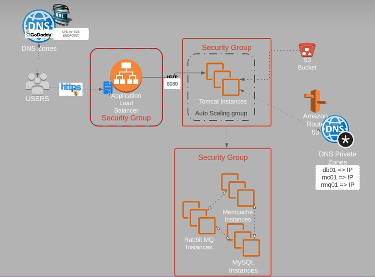

# Introduction — Lift & Shift a AWS (VProfile)

>[!NOTE]
Este repo recoge cómo migré mi stack VProfile (multi-tier) a AWS con un enfoque **Lift & Shift**: levantar lo que ya tenía y trasladarlo casi tal cual, sin reescrituras grandes. Objetivo: tener elasticidad (Auto Scaling), punto de entrada único (ALB) y aislar capas (app / backends) con seguridad y DNS privado.

## Arquitectura (resumen)
- **ALB (HTTP/HTTPS)** delante de la capa de aplicación.
- **Tomcat (EC2)** en Auto Scaling Group atendiendo en `:8080`.
- **Backends** (EC2): MySQL `:3306`, Memcached `:11211`, RabbitMQ `:5672`.
- **DNS privado (Route 53 PHZ)** para resolver `db01`, `mc01`, `rmq01` por IP privada.
- **S3** para subir artefactos (`.war`) y descargarlos desde la app.
- **Seguridad** por Security Groups (SG → SG), no por IP pública.

> Esta es la misma idea que ya tenía apuntada en mis notas del Word (stack, flujo, y razones de Lift & Shift). :contentReference[oaicite:4]{index=4}

## Flujo a alto nivel
1. Usuario llega a mi dominio (o al DNS público del ALB).
2. ALB enruta al Target Group (Tomcat en `:8080`).
3. La app habla con **MySQL**, **Memcached**, **RabbitMQ** por DNS privado.
4. El artefacto `.war` lo bajo de **S3** para desplegar.

## Pre-requisitos
- Los ficheros de provisión **.sh** se encuentran en el repositorio "https://github.com/hkhcoder/vprofile-project" 
- `<REGION>` con al menos dos subnets públicas/privadas en AZ distintas.
- Permisos para crear **EC2**, **ALB**, **ASG**, **Route 53 (PHZ)** y **S3**.

