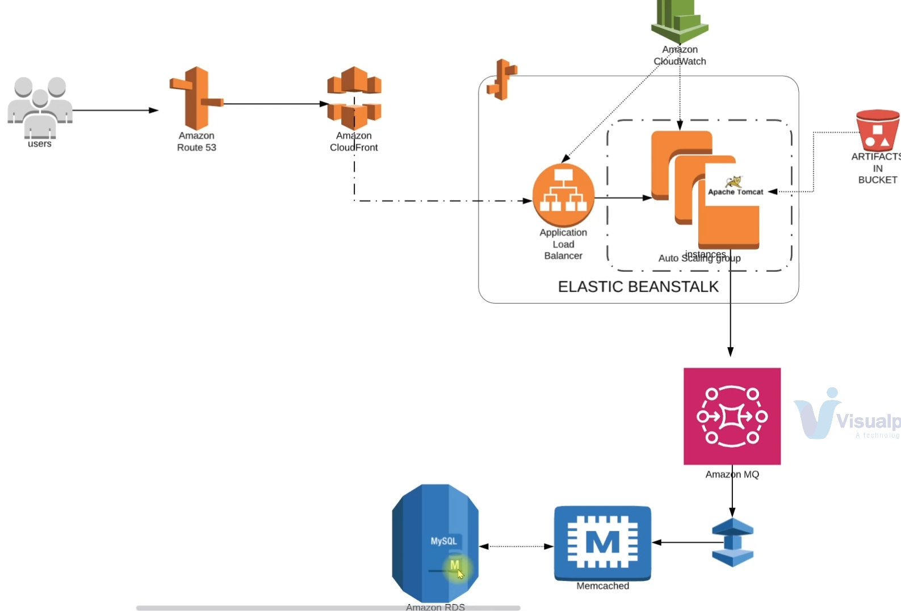

<!-- 01-introduccion.md -->
# 01 — Introducción al proyecto (Re-architecting en AWS)

> **Resumen** 
> En este proyecto migro la app **vProfile** desde una pila autogestionada a **servicios gestionados en AWS**. Quiero reducir “toil”, simplificar operaciones, mejorar escalabilidad y preparar el terreno para CI/CD.

## Objetivo de arquitectura
- **Frontend**: **Elastic Beanstalk** (orquesta EC2 + ALB + Auto Scaling + S3 para artefactos).
- **Backend**: **RDS (MySQL)**, **ElastiCache (Memcached)** y **Amazon MQ (RabbitMQ)**.
- **Borde**: **Route 53** (DNS) y **CloudFront** (CDN) para latencia global y HTTPS en el edge.
- **Seguridad**: **Security Groups dedicados**; backend privado en VPC; acceso de EB controlado por SG.

## Diagrama (alto nivel)

flowchart LR
  U[Usuarios] -->|DNS| R53[Route 53]
  R53 --> CF[CloudFront (CDN)]
  CF --> ALB[Application Load Balancer]
  ALB --> EB[Elastic Beanstalk (Tomcat)]
  EB --> RDS[(RDS MySQL)]
  EB --> MQ[(Amazon MQ - RabbitMQ)]
  EB --> MC[(ElastiCache - Memcached)]

## Decisiones clave (mi criterio)
- **Servicios gestionados primero**: DB, caché y mensajería no las administro en EC2.
- **Desacoplo datos de cómputo**: RDS va por libre; EB se despliega sin atar el ciclo de vida al dato.
- **Privado por defecto**: backend sin acceso público; sólo EB entra por SG.
- **Automatización gradual**: primero manual “conscientemente”, luego lo paso a IaC/CI-CD.

## Checklist de cierre de sesión
- [x] Alcance definido (frontend, backend, borde).
- [x] Patrón de red y seguridad acordado.
- [x] Flujo de usuario y rutas de datos entendidos.
- [x] Plan de despliegue incremental (primero “verde”, luego optimizo).

> [!NOTE]
> La documentación la redacto en primera persona y con foco en lo que realmente hice/decidí en cada paso, para reutilizarlo en el repositorio.

